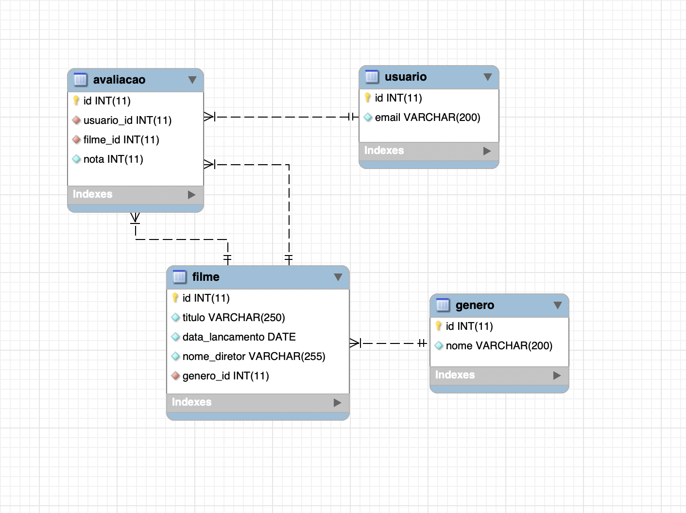

# Projeto Filmes Ubots

Este projeto é destinado a prova técnica realizada pela Ubots.

## Sumário

  - [Introdução](#introdu%C3%A7%C3%A3o)
  - [Principais recursos utilizados](#principais-recursos-utilizados)
  - [Pré-requisitos](#pr%C3%A9-requisitos)
  - [Instalação](#instala%C3%A7%C3%A3o)
  - [Modelo ER](#modelo-er)
  - [Possíveis melhorias](#poss%C3%ADveis-melhorias)
  - [Autora](#autora)
  - [License](#license)

## Introdução

API de filmes requisitada em processo de seleção;

Endpoints disponíveis em: http://localhost:8080
Swagger em: http://localhost:8080/swagger-ui.html

## Principais recursos utilizados

* [Java JDK](https://www.oracle.com/technetwork/java/javase/downloads/jdk8-downloads-2133151.html) - Ferramenta para desenvolver aplicações. Versão 8 utilizada.
  

* [Spring](https://spring.io/) - O framework java utilizado.
* [Swagger](https://swagger.io/) - Ferramenta opensource para documentação de API.
*  [Docker e Docker Compose](https://www.docker.com) - Ferramenta de criação de containers para facilitar o processo de desenvolvimento da aplicação replicando a infra de produção no ambiente de desenvolvimento.
* [Maven](https://maven.apache.org/) - Ferramenta de automação e gerenciamento de projetos.
  
## Pré-requisitos

O que foi necessário para rodar o projeto: 

- Java na versão 8
- GIT instalado
- Spring boot server
- Docker ou MySQL instalado

## Instalação

Passos necessários para rodar o projeto sem o docker: 

- Clonar no projeto: 
```
  git clone 
  https://github.com/barbbecker/projeto-filmes.git
  git
```
- Instalar o mysql ou rodar através do docker-compose que se encontra no diretório mysql:
    
```
docker-compose up --build
```

- No terminal, digitar o seguinte comando para fazer o login no servidor MySQL:

- Caso tenha seguido pela instalação do MySQL siga os passos abaixo, do contrário instale algum client MySQL (MySql Workbench) e execute o script de criação do banco.

```
mysql -u root -p
```

- Para criar o banco de dados digite os comandos, um de cada vez:

```
CREATE DATABASE IF NOT EXISTS projetofilmes;
```

```
USE projetofilmes;
```

- As seguintes tabelas precisam ser criadas
- Tabela gênero:

```
CREATE TABLE genero (id INTEGER PRIMARY KEY AUTO_INCREMENT, nome VARCHAR(200) NOT NULL);
```

- Inserir os seguintes dados na tabela gênero, para conseguir rodar o projeto:

```
INSERT INTO genero (nome) VALUES 
('Ação'), ('Animação'), ('Aventura'),('Comédia'), ('Documentário'), ('Faroeste'), ('Ficção Científica'), ('Romance'), ('Suspense'), ('Tragédia');
```

- Tabela usuário:

```
CREATE TABLE usuario (id INTEGER  PRIMARY KEY AUTO_INCREMENT, email VARCHAR(200) NOT NULL UNIQUE);
```

- Tabela filme:

```
CREATE TABLE filme (id INTEGER  PRIMARY KEY AUTO_INCREMENT, titulo VARCHAR(250) NOT NULL data_lancamento DATE NOT NULL, nome_diretor VARCHAR(255) NOT NULL, genero_id INTEGER NOT NULL);
```

- Tabela avaliação

```
CREATE TABLE avaliacao (id INTEGER  PRIMARY KEY AUTO_INCREMENT, usuario_id INTEGER NOT NULL, filme_id INTEGER NOT NULL, nota INTEGER NOT NULL);
```

- Por último, faremos com que as foreigh keys sejam criadas: 

```
ALTER TABLE filme ADD FOREIGN KEY (genero_id) REFERENCES genero (id);
```

```
ALTER TABLE avaliacao ADD FOREIGN KEY (usuario_id) REFERENCES usuario (id);
```

```
ALTER TABLE avaliacao ADD FOREIGN KEY (filme_id) REFERENCES filme (id);
```

## Modelo ER

  

## Possíveis melhorias

- Subir a API para o Heroku
- Adicionar autenticação e identificação do usuário de forma adequada
- Indicar o filme de uma forma mais inteligente olhando para as preferências do usuário
- Fazer o front da aplicação
- Melhorar o tratamento de erro padronizando os objetos, como em: https://www.toptal.com/java/spring-boot-rest-api-error-handling

  
## Autora

* **Bárbara Becker da Rosa** -  [GitHub](https://github.com/barbbecker)

<a href="https://github.com/barbbecker">
  
</a>


## License

Este projeto possui Licença MIT - veja o arquivo [LICENSE.md](LICENSE.md) para saber mais detalhes.
